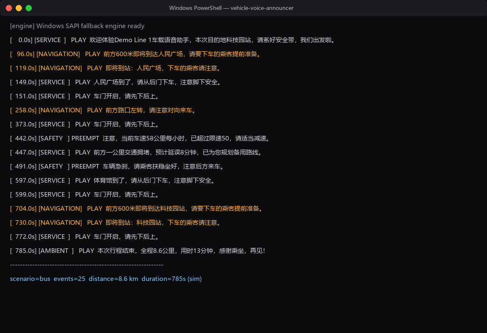
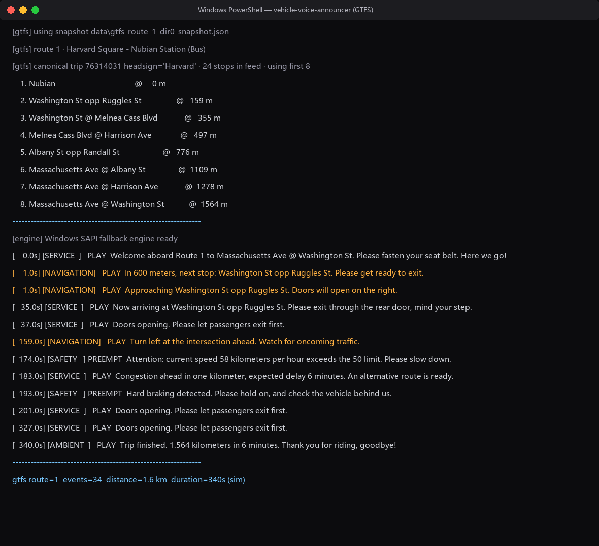
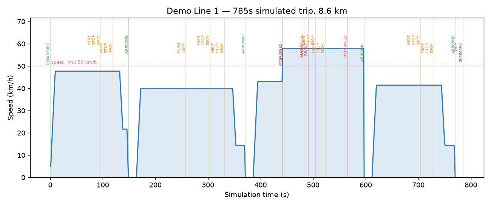
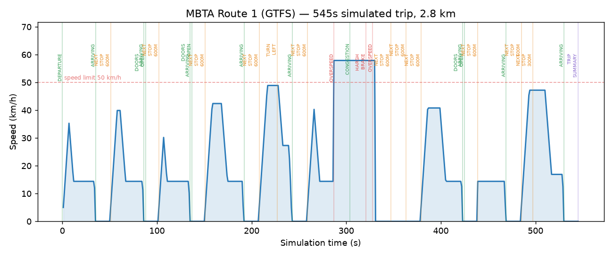
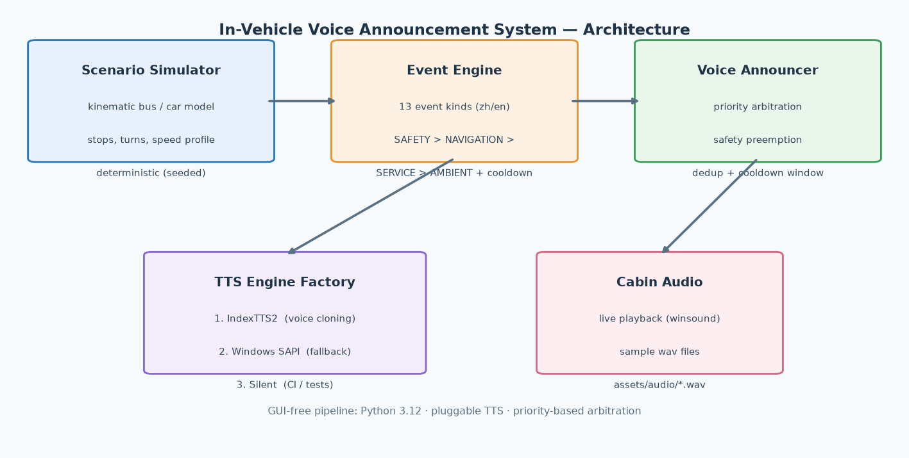

# 🚗 In-Vehicle Voice Announcement System (IndexTTS)

**A priority-aware cockpit voice assistant prototype — deterministic traffic-scenario simulation meets zero-shot neural TTS.**


A real cockpit cannot read every message out loud. Safety warnings must
interrupt navigation hints; "next stop" must not repeat every ten seconds.
This project demonstrates **how an in-vehicle voice system arbitrates
competing announcements** — and speaks them with **IndexTTS2**, Bilibili's
open-source zero-shot TTS (with a fully offline Windows SAPI fallback so the
demo runs anywhere, before any model download).

## ✨ Features

- **13 traffic event kinds** — overspeed, harsh braking, turns, congestion,
  next-stop / arrival, fatigue reminder, trip summary — with bilingual
  (🇨🇳 中文 / 🇬🇧 English) message templates.
- **Real GTFS feeds** — parses a genuine transit feed (MBTA / Boston by
  default), extracts the canonical stop sequence of a route and announces
  *real* stops with *real* inter-stop distances. Snapshot caching keeps the
  demo fully offline after the first run.
- **4-level priority arbitration**: `SAFETY > NAVIGATION > SERVICE > AMBIENT`.
  Safety announcements preempt current playback; every event kind has its own
  cooldown to avoid nagging.
- **Deterministic scenario simulators** (seeded): a 5-stop bus route with
  dwell times and a private-car commute with turns and a congested segment.
  Same seed → same trip → reproducible demos and screenshots.
- **Pluggable TTS backends** via one factory call:

  | Backend | Voice | Needs | Use case |
  |---|---|---|---|
  | `indextts` | zero-shot cloned voice | checkpoints (~GB) + GPU recommended | realistic demo |
  | `sapi` | Windows system voice | nothing (offline) | instant demo |
  | `silent` | none (log only) | nothing | CI / unit tests |

- **Zero-GUI pipeline**: CLI in, audio + log out. 5 unit tests cover the
  arbitration logic without any audio hardware.

## 🎬 Demo

Live simulation of a 8.6 km bus route (console output while speaking):



**Real GTFS route** — MBTA Route 1 "Harvard Square – Nubian Station", stop
sequence parsed from the live feed and announced with real inter-stop
distances (`python -m announcer.cli gtfs --engine sapi --lang en`):



Speed profile with triggered events — built-in route:



… and the same figure for the real MBTA stop spacing:



Pre-rendered announcement samples (Windows SAPI voice, generated by
`python -m announcer.cli generate-samples`):

| Sample | Event | Priority |
|---|---|---|
| [01_departure.wav](assets/audio/01_departure.wav) | departure greeting | SERVICE |
| [02_next_stop_600m.wav](assets/audio/02_next_stop_600m.wav) | next stop 600 m | NAVIGATION |
| [03_arriving.wav](assets/audio/03_arriving.wav) | arriving at stop | SERVICE |
| [04_turn_left.wav](assets/audio/04_turn_left.wav) | turn left ahead | NAVIGATION |
| [05_overspeed.wav](assets/audio/05_overspeed.wav) | overspeed warning | **SAFETY** |
| [06_harsh_brake.wav](assets/audio/06_harsh_brake.wav) | harsh braking | **SAFETY** |
| [07_congestion.wav](assets/audio/07_congestion.wav) | congestion ahead | SERVICE |
| [08_fatigue.wav](assets/audio/08_fatigue.wav) | fatigue reminder | AMBIENT |
| [09_trip_summary.wav](assets/audio/09_trip_summary.wav) | trip summary | AMBIENT |

## 🏗 Architecture



```
Scenario Simulator ──▶ Event Engine ──▶ Voice Announcer ──▶ Cabin Audio
 (kinematics, stops)   (13 kinds,      (priority rules,     (IndexTTS2 /
                       zh/en)          cooldown, preempt)    SAPI / silent)
```

## 🚀 Quickstart

```bash
pip install -r requirements.txt

# 1) hear a full bus trip in Chinese (SAPI voice, offline)
python -m announcer.cli simulate --scenario bus --engine sapi --speedup 15

# 2) English car commute
python -m announcer.cli simulate --scenario car --engine sapi --lang en

# 3) REAL GTFS route: MBTA Route 1 with actual stop names & distances
#    (downloads data/mbta_gtfs.zip on first run, then caches a snapshot)
python -m announcer.cli gtfs --engine sapi --lang en
python -m announcer.cli gtfs --list                 # browse routes in the feed
python -m announcer.cli gtfs --route 1 --max-stops 16 --engine indextts

# 4) logic-only run (no audio) — handy for CI
python -m announcer.cli simulate --scenario bus --engine silent --speedup 10000

# 5) regenerate the sample wav files
python -m announcer.cli generate-samples --engine sapi --lang zh

# 6) plot the speed profile with event markers
python -m announcer.cli plot --scenario bus --out docs/trip-timeline.png

# 7) run the unit tests (synthetic GTFS fixture — no network needed)
python -m unittest discover -s tests -v
```

## 🔊 Enable IndexTTS (voice cloning)

The SAPI fallback speaks with the Windows system voice. For the real
zero-shot neural voice (IndexTTS2, [index-tts/index-tts](https://github.com/index-tts/index-tts)):

```bash
# 1) clone IndexTTS and install (Python 3.10+ recommended by upstream)
git clone https://github.com/index-tts/index-tts.git
pip install -r requirements-indextts.txt
pip install -e ./index-tts

# 2) download checkpoints (IndexTeam/IndexTTS-2) from HuggingFace or ModelScope
#    into ./checkpoints  (config.yaml + model weights)

# 3) drop a 3-10 s clean speech clip at assets/voices/ref.wav

# 4) run with the neural engine
python -m announcer.cli simulate --scenario bus --engine indextts
```

Configuration is environment-variable based:
`INDEXTTS_CKPT_DIR` (default `checkpoints`), `INDEXTTS_CONFIG`,
`INDEXTTS_REF_VOICE` (default `assets/voices/ref.wav`).

If the package or checkpoints are missing, the factory logs the reason and
falls back to SAPI automatically — the demo never breaks.

## 📁 Project structure

```
announcer/
├── events.py        # Event model, 4 priority classes, bilingual templates
├── scenario.py      # bus & car trip simulators + timeline plotting
├── gtfs.py          # GTFS feed download/parse, stop-sequence extraction, snapshots
├── announcer.py     # arbitration: preemption, cooldown, logging
├── cli.py           # simulate / gtfs / generate-samples / plot / list-events
└── tts/
    ├── base.py              # engine contract
    ├── indextts_engine.py   # IndexTTS2 wrapper (optional)
    ├── sapi_engine.py       # offline Windows fallback
    └── silent_engine.py     # CI / tests
tests/
├── test_announcer.py        # arbitration unit tests
└── test_gtfs.py             # GTFS parsing tests (synthetic mini-feed, offline)
assets/audio/*.wav            # pre-rendered samples (committed)
data/gtfs_route_1_dir0_snapshot.json   # cached MBTA route snapshot (committed)
docs/                         # architecture, screenshots, timelines
```

## 🧠 Design notes

- **Why priority classes?** Real HMI guidelines (e.g., NHTSA distraction
  guidelines, in-cockpit audio management) require safety messages to
  interrupt lower-priority audio. `Priority.SAFETY` calls `engine.stop()`
  before speaking; the arbitration rules are unit-tested.
- **Why cooldowns?** A bus passes "next stop" thresholds repeatedly;
  a per-event-kind cooldown window models real announcement discipline.
- **Why a simulator instead of live GPS?** Deterministic seeds make the demo
  reproducible in an interview; swapping in a live GPS feed only replaces
  `scenario.run()`.
- **Why the fallback chain?** Neural TTS checkpoints are heavy and GPU-bound.
  The factory (`announcer.tts.create_engine`) degrades gracefully:
  IndexTTS2 → SAPI → Silent, so the repo is always runnable.

## 🗺 Roadmap

- [x] **GTFS integration** — real stop sequences from a live transit feed
      (MBTA), snapshot caching for offline demos
- [ ] NTCIP SPaT / signal-phase events as an additional event source
- [ ] V2X (DSRC / C-V2X) simulated message ingestion
- [ ] Gradio web UI with scenario picker and waveform preview

## 📄 License

[MIT](LICENSE)
