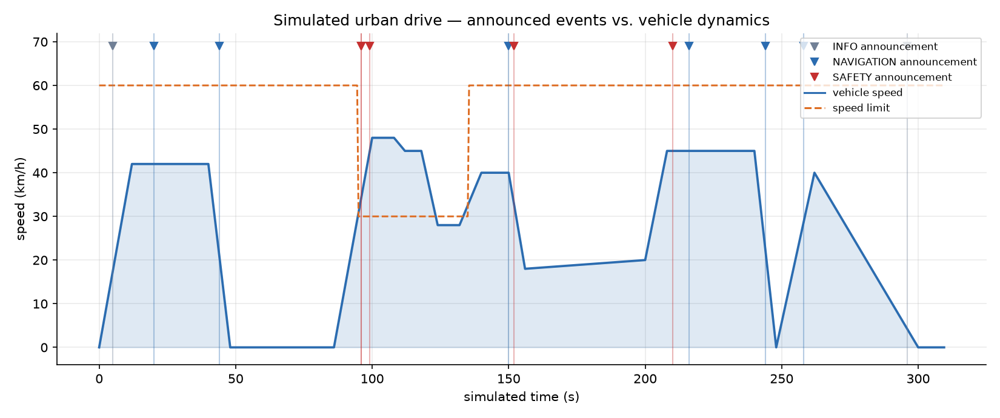
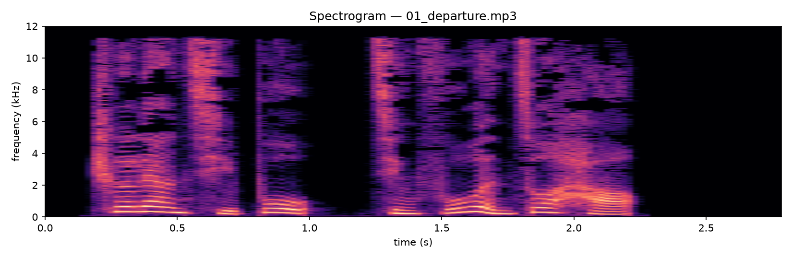
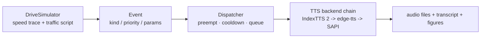

# Vehicle Voice Announcer

[](https://github.com/klsheng1/vehicle-voice-announcer/actions/workflows/ci.yml)


An **in-vehicle voice announcement system** built around **IndexTTS 2** (zero-shot voice
cloning). A simulated urban bus drive emits traffic events — red lights, school zones,
speeding, congestion, blind-spot cyclists, stop arrivals — and a priority-aware dispatcher
decides what gets spoken, what waits, and what gets cancelled, then a pluggable TTS stack
renders the prompts.



## Why this is interesting

A voice alert system in a car/bus is not "text-to-speech" — the hard part is *arbitration*.
This repo implements the three rules real HMI systems live by:

| Rule | Behaviour | Demo transcript |
|---|---|---|
| **Priority preemption** | A SAFETY alert cancels a NAVIGATION message that is still playing | `blind_spot` cancels `congestion` |
| **Cooldown suppression** | The same alert family can't repeat within N seconds (no nagging) | second `next_stop` 8 s apart is dropped |
| **FIFO deferral** | Same-priority messages queue and play when the current one finishes | `speeding` waits for `sharp_turn` |

```console
[01:36] SAFE  sharp_turn   ANNOUNCE  前方急转弯，请减速慢行。
[01:36] SAFE  speeding     QUEUED    当前车速超过限速，请减速行驶。
[02:30] NAV   congestion   ANNOUNCE  前方路段拥堵，预计通行时间6分钟。
[02:32] SAFE  blind_spot   PREEMPT   (cancels 'congestion': priority SAFETY > NAVIGATION)
[02:32] SAFE  blind_spot   ANNOUNCE  注意，右后方有非机动车接近，请避让。
[03:44] NAV   next_stop    SUPPRESS  (cooldown group 'next_stop' fired 8s ago)
```

The full run produces real audio files — listen to the samples (Mandarin, `edge-tts` neural
voice; swap in IndexTTS for a cloned driver voice):

| Sample | Prompt (zh) |
|---|---|
| [01_departure.mp3](docs/samples/01_departure.mp3) | 车辆起步，请扶稳坐好。 |
| [03_red_light.mp3](docs/samples/03_red_light.mp3) | 前方红灯，预计等待40秒，请耐心等候。 |
| [06_school_zone.mp3](docs/samples/06_school_zone.mp3) | 已进入学校区域，注意儿童，减速慢行。 |
| [07_congestion.mp3](docs/samples/07_congestion.mp3) | 前方路段拥堵，预计通行时间6分钟。 |
| [08_blind_spot.mp3](docs/samples/08_blind_spot.mp3) | 注意，右后方有非机动车接近，请避让。 |
| [11_arriving.mp3](docs/samples/11_arriving.mp3) | 前方到站：人民广场，请准备从后门下车。 |



## Architecture



* **`announcer/sim.py`** — deterministic 5-minute urban drive: a speed trace with a school
  zone, a red light, congestion and a bus stop. Speeding alerts are *derived* from the trace
  (speed > limit), so the dispatcher faces realistic repeat events.
* **`announcer/dispatcher.py`** — pure arbitration logic, fully unit-tested, no audio
  dependencies.
* **`announcer/prompts.py`** — bilingual (zh/en) prompt templates per event kind.
* **`announcer/tts/`** — pluggable backends behind one interface, with content-addressed
  caching:
  | Backend | Voice | Needs |
  |---|---|---|
  | `index-tts` (primary) | zero-shot **voice cloning** from a few seconds of reference audio | IndexTTS 2 repo + checkpoints, GPU recommended |
  | `edge` | Microsoft neural voices | `pip install edge-tts`, network |
  | `sapi` | Windows SAPI 5 (robotic) | `pip install pyttsx3`, works offline |

  `--backend auto` picks the best one actually installed on the machine, so the demo runs
  everywhere.

## IndexTTS setup (primary backend)

```bash
git clone https://github.com/index-tts/index-tts
cd index-tts
uv sync                                        # or: pip install -e .
hf download IndexTeam/IndexTTS-2 --local-dir checkpoints
```

```bash
set INDEX_TTS_REPO=C:/path/to/index-tts
set INDEX_TTS_VOICE=C:/path/to/driver_sample.wav   # a few seconds of the target voice
python -m announcer.cli --backend index-tts
```

Every announcement is then rendered in the cloned voice. The wrapper tries the Python API
(`indextts.infer_v2.IndexTTS2`) first and falls back to the repo CLI; without the repo it
fails with setup instructions instead of silently degrading.

## Quickstart

```bash
pip install -r requirements.txt

python -m announcer.cli                        # auto backend, zh prompts, audio + figures
python -m announcer.cli --backend edge --lang en
python -m announcer.cli --no-audio             # arbitration only (runs in CI)
python -m pytest                               # dispatcher + prompt unit tests
```

Outputs land in `output/` (numbered audio files + `transcript.txt`); figures go to
`docs/images/`.

## Project structure

```
announcer/
  events.py      Event dataclass (kind, priority, params, cooldown key)
  prompts.py     zh/en prompt templates
  dispatcher.py  preemption / cooldown / queue arbitration
  sim.py         scripted drive: speed trace + traffic events
  figures.py     drive timeline + spectrogram (numpy FFT, no scipy)
  cli.py         player: decisions -> TTS -> transcript + figures
  tts/           base.py, index_tts.py, edge.py, sapi.py + auto-selection
tests/           unit tests for the dispatcher and prompt rendering
```

## Ideas for a real integration

- Replace `sim.py` with CAN bus / ADAS signals (speed, gear, signal state) — the `Event`
  contract stays the same.
- Audio focus management: duck the media stream while a SAFETY clip plays.
- Quantile latency budgeting: pre-synthesise common prompts at boot, synthesise rare ones
  on demand (the cache in `tts/base.py` already supports this).

## License

MIT — see [LICENSE](LICENSE).
